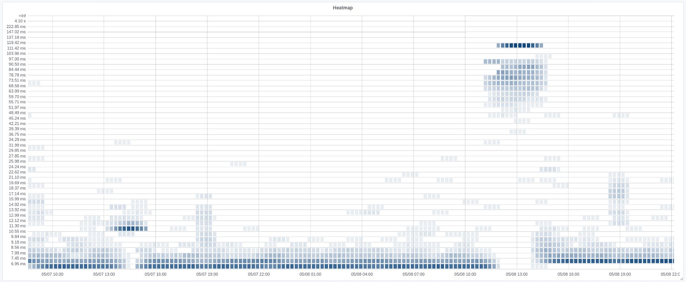
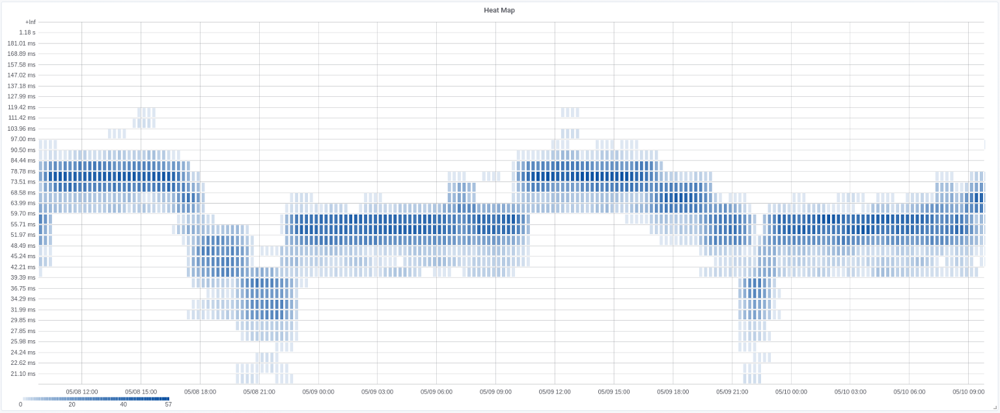
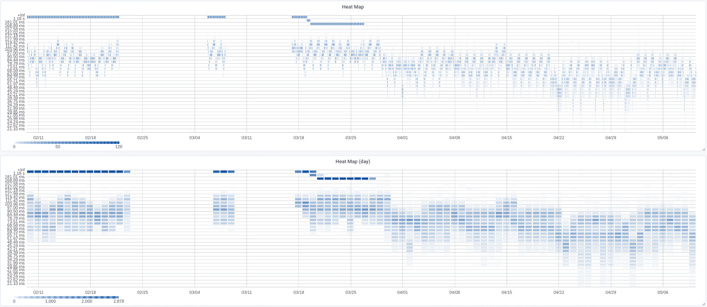

# meshping #

Ping daemon that pings a number of targets at once, collecting their response times in histograms. Meant to be deployed at strategic points in your network in order to detect weak links.

## Features

* Scrapeable by [Prometheus](prometheus.io).
* Targets can be added and removed on-the-fly, without restarting or reloading anything.
* CLI tool to interact with the daemon.
* IPv6 supported.

## Screenshots

### Heatmaps

Grafana added Prometheus-compatible Heatmaps in version 5.1. Those let you render graphs like these, showing when your ISP failovers you to a second line:



Here you can nicely see that at `05/07 13:00` there was a minor outage (failover to a different router on the same line, basically), and at
`05/08 13:00` something big happened (main line went down completely and we switched to the backup line).

Or that this power converter hardware you bought recently is a bit weird:



The latter is a normal distribution, which is an indication that you're looking at too small a time frame. Let's look at this heatmap over
ninety days, and compare it to one that aggregates one day's worth of data per histogram:



This is a lot less noisy.

### Summary

If you point your browser to Meshping at `http://localhost:9922`, you'll get statistics like this:

```
Target                    Address                    Sent  Recv   Succ    Loss      Min    Avg15m     Avg6h    Avg24h       Max      Last
dc.local.lan.             10.5.0.10                 22863 22669  99.15%   0.85%    0.06      0.97      0.95      0.89     13.87      1.33
alexi001.local.lan.       10.5.0.122                19644 19587  99.71%   0.29%    0.05      1.02      0.90      0.85     12.38      1.35
alexi002.local.lan.       10.5.0.123                19643 19523  99.39%   0.61%    0.06      1.21      1.18      1.14     14.97      2.38
alexi003.local.lan.       10.5.0.124                19644 19470  99.11%   0.89%    0.06      0.86      0.96      0.93     13.19      2.17
10.5.1.2                  10.5.1.2                  22863 22819  99.81%   0.19%  606.30    746.00    806.17    867.11   4245.05    713.65
inverter.local.lan.       192.168.0.101             22863 22821  99.82%   0.18%    0.49     45.01     50.59     41.06    144.25     34.96
snom370-260DFE.local.lan  192.168.0.117             22863 22812  99.78%   0.22%    0.83      1.51      1.57      1.48   1000.03      1.39
```

### Raw data

If you query the `/metrics` endpoint, you get a histogram that carries far more detail:

```
meshping_sent{target="10.5.1.2"} 7362
meshping_recv{target="10.5.1.2"} 7330
meshping_lost{target="10.5.1.2"} 32
meshping_max{target="10.5.1.2"} 3848.67
meshping_min{target="10.5.1.2"} 608.21
meshping_pings_sum{target="10.5.1.2"} 6704337.831000
meshping_pings_count{target="10.5.1.2"} 7330
meshping_pings_bucket{target="10.5.1.2",le="630.34"} 72
meshping_pings_bucket{target="10.5.1.2",le="675.58"} 1014
meshping_pings_bucket{target="10.5.1.2",le="724.07"} 2117
meshping_pings_bucket{target="10.5.1.2",le="776.04"} 2979
meshping_pings_bucket{target="10.5.1.2",le="831.74"} 3706
meshping_pings_bucket{target="10.5.1.2",le="891.43"} 4550
meshping_pings_bucket{target="10.5.1.2",le="955.42"} 5286
meshping_pings_bucket{target="10.5.1.2",le="1023.99"} 5908
meshping_pings_bucket{target="10.5.1.2",le="1097.49"} 6340
meshping_pings_bucket{target="10.5.1.2",le="1176.26"} 6565
meshping_pings_bucket{target="10.5.1.2",le="1260.68"} 6685
meshping_pings_bucket{target="10.5.1.2",le="1351.17"} 6762
meshping_pings_bucket{target="10.5.1.2",le="1448.14"} 6830
meshping_pings_bucket{target="10.5.1.2",le="1552.08"} 6903
meshping_pings_bucket{target="10.5.1.2",le="1663.48"} 6976
meshping_pings_bucket{target="10.5.1.2",le="1782.88"} 7050
meshping_pings_bucket{target="10.5.1.2",le="1910.84"} 7125
meshping_pings_bucket{target="10.5.1.2",le="2047.99"} 7176
meshping_pings_bucket{target="10.5.1.2",le="2194.98"} 7217
meshping_pings_bucket{target="10.5.1.2",le="2352.52"} 7255
meshping_pings_bucket{target="10.5.1.2",le="2521.37"} 7281
meshping_pings_bucket{target="10.5.1.2",le="2702.34"} 7301
meshping_pings_bucket{target="10.5.1.2",le="2896.30"} 7311
meshping_pings_bucket{target="10.5.1.2",le="3104.18"} 7320
meshping_pings_bucket{target="10.5.1.2",le="3326.98"} 7323
meshping_pings_bucket{target="10.5.1.2",le="3565.77"} 7327
meshping_pings_bucket{target="10.5.1.2",le="3821.69"} 7329
meshping_pings_bucket{target="10.5.1.2",le="4095.99"} 7330
```

This endpoint is meant to be scraped by Prometheus.

## Querying from Prometheus

You can run queries on the data from Prometheus, e.g.

 * loss rate in %: `rate(meshping_lost{target="$target"}[2m]) / rate(meshping_sent[2m]) * 100`
 * quantiles: `histogram_quantile(0.95, rate(meshping_pings_bucket{target="$target"}[2m]))`
 * averages: `rate(meshping_pings_sum{target="10.5.1.2"}[2m]) / rate(meshping_pings_count[2m])`

## Heatmaps in Grafana

Grafana added [Heatmap support](https://github.com/grafana/grafana/issues/10009) in v5.1, so we now can produce graphs like the images above,
that contain a [histogram over time](http://docs.grafana.org/img/docs/v43/heatmap_histogram_over_time.png) that shows the pings.

To do that, add a Heatmap panel to Grafana, and configure it with:

* Query: `increase(meshping_pings_bucket{target=\"$target\"}[1h])`
* Legend format: `{{ le }}`
* Unit: `ms`
* Min step: `1h`

For a one-histogram-per-day panel, use these settings:

* Query: `increase(meshping_pings_bucket{target=\"$target\"}[1d])`
* Min step: `1d`


Meshping is meant to look at pings over a long time range (e.g. two days or a week), so be sure not to make those time frames too short.
Otherwise you'll lose the heatmap effect because every data point will be its own histogram.

In the examples directory, there's also a [json dashboard definition](examples/grafana.json) that you can import.


# How do I get set up?

## Using Docker

You can run meshping itself through Docker, but you'll need to provide a Redis instance and will need `mpcli` somewhere so you can add targets to meshping (see below):

```
docker run --rm --net=host -e REDIS_HOST=redisbox svedrin/meshping:latest
wget https://raw.githubusercontent.com/Svedrin/meshping/master/cli.py -O /usr/local/bin/mpcli
chmod +x /usr/local/bin/mpcli
```

The CLI needs to be able to talk to the Redis instance. It is included in the Docker image, so you can also use:

```
docker run --rm -it --net=host svedrin/meshping:latest mpcli
```

## Adding targets

To add targets, run `mpcli -a <target name>[@<target IP address>]`. Examples:

```
mpcli -a google.com@8.8.8.8
mpcli -a google.com@8.8.4.4
mpcli -a google.com
mpcli -a 8.8.8.8
mpcli -a example.com
mpcli -a 192.168.0.1
```

Meshping will pick up updates to the target list before the next ping iteration.


# Distributed Meshping

Meshping supports running multiple meshping instances that ping the same targets, each reporting stats from their
point of view. To use this, set up a master instance like outlined above, and configure its Redis server to be reachable
from the slaves. Then, edit `meshping.service` on the slaves to point to the Master's redis instance, like so:

```
ExecStart=/usr/bin/python -- /opt/meshping/src/meshping.py -r hive.local.lan
```

Restart Meshping, and it'll pick up on the targets immediately.


# Who do I talk to?

* If you'd like to get in touch, you can send me an [email](mailto:i.am@svedr.in).
* I also regularly hang out at the Linux User Group or the [mag.lab](http://mag.lab.sh) in Fulda.
