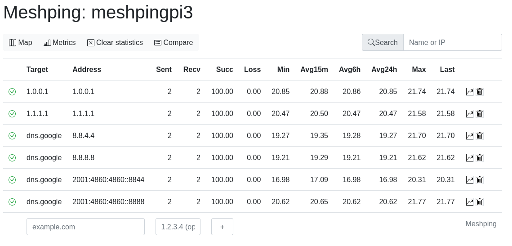
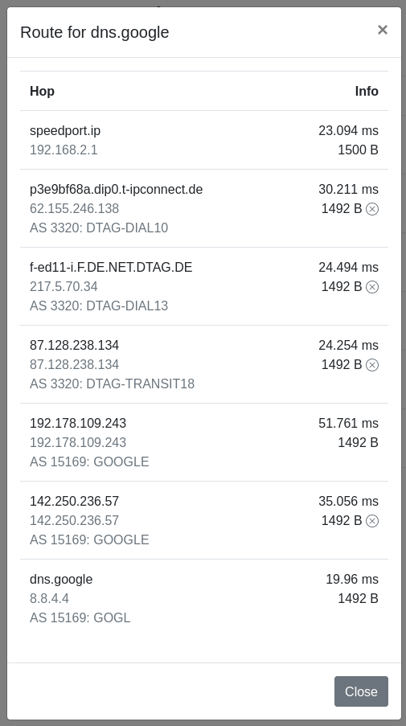
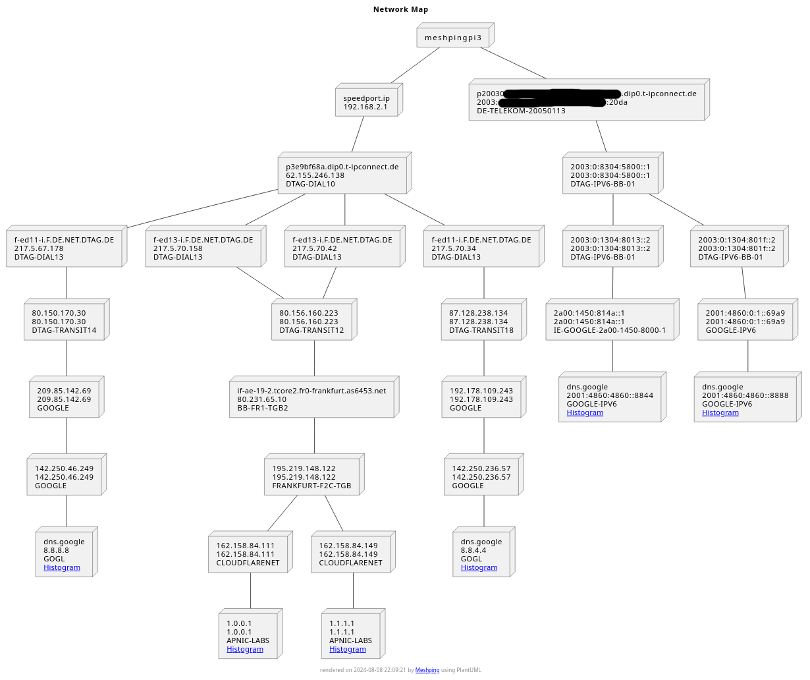

# meshping

Ping daemon that pings a number of targets at once, collecting their response times in histograms. Meant to be deployed at strategic points in your network in order to detect weak links.

## Features

* Graphs show latencies as they are, not aggregated into an average.
* Runs traceroute to show the hops between your monitoring node and the targets.
* Uses traced routes to draw a map of your network, rendered as an SVG.
* Performs [Path MTU discovery](https://en.wikipedia.org/wiki/Path_MTU_Discovery) for each hop along the route, so you can see where MTUs get smaller.
* Detects and displays routing loops.
* Shows [AS](https://en.wikipedia.org/wiki/Autonomous_system_(Internet)) info about the hops along the route.
* Multiple targets can be rendered in a single graph for comparison.
* Meshping instances can be [peered](#wide-distribution-peering) with one another and will then ping the same targets.
* Scrapeable by [Prometheus](prometheus.io).
* Targets can be added and removed on-the-fly, without restarting or reloading anything.
* IPv6 supported.
* Docker images: https://hub.docker.com/r/svedrin/meshping


# UI

Here's a screenshot of the main Web UI:



There's a mobile-friendly version too:


Loop detection looks like this:


Here's a view of the traced route, including the Path MTU up to each hop and the AS information:



Last but not least, here's an example for a network map, also including AS information:




# Heatmaps

Meshping can render heatmaps from the pings measured over the last few (by default, three) days. They look like this:


You can nicely see that, while most of the pings are between 11 and 16ms, a significant number take around 22ms. This indicates that under some conditions, packets may take a different route to the recipient, or the recipient may just take longer to send a reply.

Here's one we recently used to debug connectivity issues a customer was having in one of our datacenters. One of the firewalls had gone bonkers, occasionally delaying packets. The average ping had gone up to 7ms, which maybe would not have looked all that bad, but the histogram very clearly shows that something's wrong:


This was actually bad enough that RDP sessions would drop and file shares would become unavailable. Being able to clearly see the issue (and also verify the fix!) was invaluable.

Here's the heatmap for a WiFi point-to-point link that spans a few kilometers:


Most pings are fine, but there does appear to be a fair bit of disturbance - maybe there's a tree in the way.

The time span covered by these can be configured by setting the `MESHPING_HISTOGRAM_DAYS` environment variable to a value other than `3`.


# Deploying

Deploying meshping is easiest using [`docker-compose`](https://docs.docker.com/compose/), with the
[docker-compose.yaml](https://github.com/Svedrin/meshping/blob/master/examples/docker-compose.yaml) file from this repo.
This will deploy meshping, along with a [Watchtower](https://hub.docker.com/r/containrrr/watchtower) instance that keeps
Meshping up-to-date. It can be deployed as-is by adding a Stack through Portainer, or using `docker-compose`:

    mkdir meshping
    cd meshping
    wget https://raw.githubusercontent.com/Svedrin/meshping/master/examples/docker-compose.yaml
    docker compose up --detach

Meshping should now be reachable at `http://<your-ip>:9922`.

## Running on a Raspberry Pi

A Docker image for the Raspberry Pi 4 is also available. To use it, you need to have:

* Docker version 19.03.9 or newer, and
* libseccomp version 2.4.2 or newer.

See [issue #30](https://github.com/Svedrin/meshping/issues/30#issuecomment-872066856) for details and instructions on how you can check if you have them, and provide them if not.

## Running on Windows

Running meshping on Windows is easiest using Docker Desktop and the WSL2 backend. Do use this method, you need to have WSL2 and Docker installed. Then run these commands in a PowerShell terminal:

```
docker volume create meshping-db
docker run -d --name meshping -p 9922:9922 --restart=always --hostname (Get-Item env:\Computername).Value -v meshping-db:/opt/meshping/db svedrin/meshping
```

This will start MeshPing and configure it to start automatically and show the correct hostname in the UI.


# Distributed Meshping

If you have set up multiple Meshping instances, you can have them exchange targets via peering. To do this, set the
`MESHPING_PEERS` env var in each instance to point to each other. That way, they will exchange target lists regularly,
and you will be able to retrieve statistics from both sides to see how your links are doing.


# Latency Analysis

When doing mathematical analyses on measurements, monitoring tools usually apply calculations based on averages and standard deviations.
With latency data however, these methods yield unsatisfactory results.

Let's take another look at this heatmap:


You'll see that, while most of the pings are between 11 and 16ms, a significant number take around 22ms.
The average as calculated by meshping is 16ms, and the standard deviation is probably somewhere around 2ms.

Now suppose you're trying to formulate an alerting rule based on those numbers. Say you'd want to be alerted whenever ping results differ
from the average for more than two standard deviations. This means that data points smaller than 12ms or greater than 20ms would potentially
trigger an alert. Since this would probably be a bit noisy, let's assume you'll only alert after a bunch of those arrive over a given time span.

But as you can see from the graph, there's a significant number of pings that just take 22ms, for whatever reason. Since this is a WAN link
that we don't have control over, we won't be able to fix it - we just have to take it for what it is. Now how do you express that in terms
of averages and standard deviations? The answer is: you can't, because the data does not follow a
[Normal distribution](https://en.wikipedia.org/wiki/Normal_distribution). Instead, this signal consists of _two separate_ signals (because
it seems that these packets can take two different routes, resulting in a small difference in latency), each of which _can_ be described using
those terms: one lives at 13±3ms, the other one at 22±2ms. To conduct a meaningful analysis of this data, you can't just approach it as if
it consisted of one single signal.

I'd like to start looking for a solution to this. At the moment I'm focusing on getting the graphs to a point that they visualize this, and I'm
pretty satisfied with the heatmaps as they are currently. Next, I'll probably look into
[modality detection](https://www.brendangregg.com/FrequencyTrails/modes.html) and finding ways to extract patterns
out of the data that I can then use to draw conclusions from.

Much of this is derived from [Theo Schlossnagle's talk about Math in big sytems](https://www.youtube.com/watch?v=NUMBd6tlfO0), go check it out if you want to know more.


# Prometheus

Meshping provides a `/metrics` endpoint that is meant to be scraped by Prometheus. You can run queries on the data for things such as:

 * loss rate in %: `rate(meshping_lost{target="$target"}[2m]) / rate(meshping_sent[2m]) * 100`
 * quantiles: `histogram_quantile(0.95, rate(meshping_pings_bucket{target="$target"}[2m]))`
 * averages: `rate(meshping_pings_sum{target="10.5.1.2"}[2m]) / rate(meshping_pings_count[2m])`


# Configuration options

Meshping is configured through environment variables. These exist:

* `MESHPING_TIMEOUT`: Ping timeout (default: 5s).
* `MESHPING_PEERS`: Comma-separated list of other Meshping instances to peer with (only `ip:port`, no URLs).
* `MESHPING_HISTOGRAM_DAYS`: How many days of data to keep in the histograms (default: 3).


# Dev build

Building locally for development is easiest by running the `./run-dev.sh` script. It will build the container and start up Meshping.


# Known issues

* If you're running meshping behind nginx, be sure to set `proxy_http_version 1.1;` or it'll be unbearably slow.


# Who do I talk to?

* First and foremost: Feel free to open an [issue](https://github.com/Svedrin/meshping/issues/new) in this repository. :)
* If you'd like to get in touch, you can send me an [email](mailto:i.am@svedr.in).
* I also regularly hang out at the [Linux User Group in Fulda](https://lugfd.de/).
